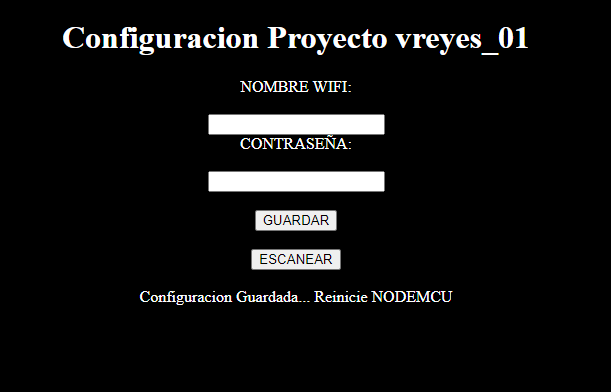
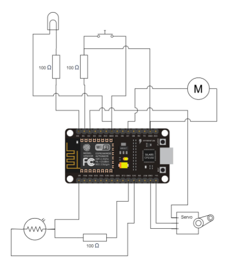

# Proyecto_MQTT_vreyes
_Proyecto mqtt esp8266 para el envio y recivo de comandos y mensajeria_

## INSTRUCCIONES 
Una conexion WiFi manual atravez de WiFi directo del NODEMCU, se ingresara a la pagina web con la ip: "http://192.168.4.1/" 


la cual es configurada luego de presionar el boton antes de 10 segundos iniciado el proyecto estos datos se guardan en una memoria EEPROM la cual hara que luego de reiniciar el proyecto, se conecte a la red WiFi establecida automaticamente
mediante una conexion atravez de la aplicacion [MQTT Dash](https://play.google.com/store/apps/details?id=net.routix.mqttdash&hl=es_419&gl=US) de Google Playstore

Se realizara la conexion mediante los siguientes parametros ingresados:

```
* Address: ioticos.org
* Port: 1883
* User name: TR3oNPxXnCEzopw
* User password: mPhIlrLrLkwAVnq
```

Luego en "Import/Export" Ingresar el topico:
```
vghyF5od2LPHke6/config/parametros
```

y seleccionar *"subscribe and wait for metrics"* para obtener los botones ya configurados

## Diagrama del proyecto


[Diagrama](diagrama_proyecto.jpg)

---
Proyecto hecho por [Vreyes26](https://github.com/Vreyes26/Proyecto_MQTT_vreyes)
